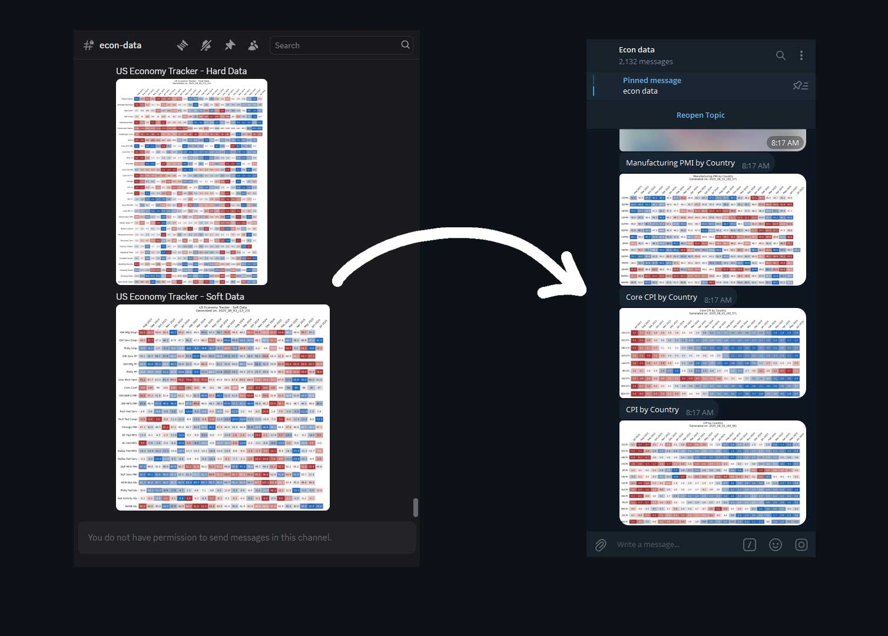

# Discord-to-Telegram Mirror Bot

A robust Python script for mirroring content from specified Discord channels to corresponding threads in a Telegram channel. This project is designed as a data pipeline to forward messages, embeds, and images automatically.

## Features

- **Channel-to-Thread Mapping:** Easily configure which Discord channel mirrors to which Telegram channel thread.
- **Content Processing:** Intelligently parses Discord messages, including complex embeds, and reformats them for clean presentation on Telegram.
- **Image & Attachment Handling:** Automatically downloads images from Discord and re-uploads them to Telegram, supporting media groups for multiple images.
- **State Management:** Keeps track of processed messages in a local JSON file (`upload_history.json`) to prevent duplicate posts.
- **Rate Limiting:** Includes a configurable delay between messages to respect API limits.
- **Professional & Secure:** Uses official Bot APIs and externalizes all sensitive credentials into a `config.json` file.

## Tech Stack

- **Language:** Python 3
- **Core Libraries:** `requests` for all API interactions.
- **Automation:** Scheduled to run via a Cronjob on a Linux VPS.
- **APIs:** Discord Bot API, Telegram Bot API.

## Setup & Configuration

1.  **Clone the repository:**
    ```bash
    git clone [your-repo-url]
    cd [your-repo-name]
    ```

2.  **Install dependencies:**
    ```bash
    pip install requests
    ```

3.  **Create a Discord Bot:**
    - Go to the [Discord Developer Portal](https://discord.com/developers/applications).
    - Create a new Application.
    - Go to the "Bot" tab, create a Bot user, and copy the **Bot Token**.
    - You must invite this bot to the Discord server you want to monitor.

4.  **Create a Telegram Bot:**
    - Talk to the `@BotFather` on Telegram.
    - Create a new bot and copy the **HTTP API Token**.
    - Add this bot as an administrator to your Telegram channel.

5.  **Configure the Script:**
    - Create a file named `config.json` in the same directory.
    - Copy the structure below and fill it with your own credentials and channel/thread IDs.

    ```json
    {
      "DISCORD_BOT_TOKEN": "YOUR_DISCORD_BOT_TOKEN_HERE",
      "TELEGRAM_BOT_TOKEN": "YOUR_TELEGRAM_BOT_TOKEN_HERE",
      "FILTER_WORDS": ["word_to_remove_1", "word_to_remove_2"],
      "MESSAGE_WINDOW_HOURS": 1,
      "CHANNEL_MAPPING": {
        "DISCORD_CHANNEL_ID_1": [-100TELEGRAM_CHAT_ID, TELEGRAM_THREAD_ID_1],
        "DISCORD_CHANNEL_ID_2": [-100TELEGRAM_CHAT_ID, TELEGRAM_THREAD_ID_2]
      }
    }
    ```
    
**Note:** The `config.json` file should be added to your `.gitignore` file to prevent accidentally committing your secrets.
